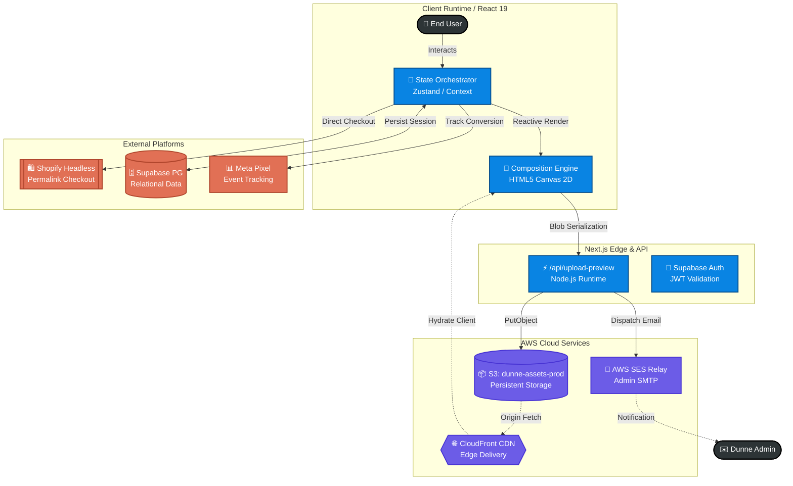

# Dunne Customizer App

Welcome to the **Dunne Customizer App**! This application is a custom jewelry builder built specifically for Dunne, providing an interactive, scalable, and beautifully designed user experience for composing charm jewelry.

📍 **Live Demo**: [https://makeyourown.dunne.co.in/apps/customizer](https://makeyourown.dunne.co.in/apps/customizer)

---

## 📖 Project Overview

The Customizer empowers end-users to interactively design unique pieces of jewelry. By rendering a 2D HTML5 Canvas, users can place charms on base products (necklaces, bracelets), preview their designs in real-time, and seamlessly transition into a Shopify headless checkout flow.

Behind the scenes, the app leverages a modern, serverless architecture to ensure blazing-fast edge delivery, robust persistence, and immediate fulfillment notifications.

---

## 🏗 System Architecture

The project is structured into four primary layers, enabling a clear separation of concerns between client interactivity, API routing, robust cloud storage, and external e-commerce handling.

### 1. Client Runtime (React 19 & Tailwind CSS)
- **State Orchestrator:** Uses Zustand and React Context to manage complex, deeply nested user selections (base items, charms, positions).
- **Composition Engine:** Custom-built HTML5 Canvas 2D engine that renders selected jewelry components into a high-fidelity preview. Generates optimal Blob/Base64 representations to send to the backend.

### 2. Middleware & API Layer (Next.js Edge)
- **Node.js Runtime Endpoints (`/api/upload-preview`):** Processes incoming canvas screenshots, forwards streams directly to AWS S3, and triggers internal email services.
- **Supabase Auth Integration:** Performs JWT validation and secures custom user routes or administrative actions.

### 3. Infrastructure (AWS Cloud Services)
- **Amazon S3 (`dunne-assets-prod`):** Stores user-generated design previews persistently as resilient objects.
- **Amazon CloudFront:** Actively caches static and dynamic image assets at Edge locations worldwide for minimal latency.
- **Amazon SES (Simple Email Service):** Fires an event-driven SMTP relay to immediately notify the `Dunnemedia1212` admin team with embedded S3 images and order metafields.

### 4. Application Integrations
- **Shopify Storefront API:** Rather than maintaining an isolated DB, the client compiles design metadata and product details, formulating a bespoke "Permalink Checkout" URL. The user is redirected natively to Shopify's optimized checkout funnel.
- **Supabase PostgreSQL:** Acts as the relational engine handling active session data, abandoned cart recovery metrics, and general scalable state syncing.
- **Meta Pixel SDK:** Dispatches critical e-commerce events (e.g., `InitiateCheckout`, `AddToCart`) directly from the client for advertising telemetry.

---

## 📊 Architecture Diagram



---

## 🚀 Getting Started

### Prerequisites

You will need the following environment variables configured in your `.env.local` to run this project smoothly:

- **AWS Credentials:** `AWS_REGION`, `AWS_ACCESS_KEY_ID`, `AWS_SECRET_ACCESS_KEY`, `AWS_S3_BUCKET_NAME`
- **Supabase Credentials:** `NEXT_PUBLIC_SUPABASE_URL`, `NEXT_PUBLIC_SUPABASE_ANON_KEY`
- **Shopify & CloudFront Endpoints:** Make sure the proper proxy/domains are supplied for seamless checkout integrations.

### Installation

1. Clone the repository:
   ```bash
   git clone https://github.com/priyanshu14077/dunne-app.git
   ```
2. Install dependencies (utilizing npm/yarn/pnpm):
   ```bash
   npm install
   ```
3. Boot up the Next.js development server:
   ```bash
   npm run dev
   ```

*Open `http://localhost:3000` with your browser to see the result.*

---

## 🛠 Tech Stack Snapshot

| Layer | Technologies |
|---|---|
| **Framework** | Next.js 16 (App Router), React 19 |
| **Styling** | Tailwind CSS v4, PostCSS |
| **Media Handling** | HTML5 Canvas, html-to-image |
| **Cloud/Infra** | AWS S3, CloudFront, AWS SES |
| **Analytics/Auth** | Supabase, Meta Pixel (`react-facebook-pixel`) |
| **Tooling** | TypeScript, ESLint |

---

*For further contributions, please verify that both `npm run build` and `npm run lint` pass successfully.*