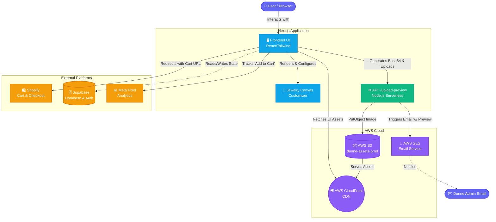

# Dunne Customizer App

This is a Next.js web application that powers the custom jewelry builder for **Dunne**.

Give A Visit @ [https://makeyourown.dunne.co.in/apps/customizer](https://makeyourown.dunne.co.in/apps/customizer)

## System Architecture

The application is built on a modern serverless architecture utilizing Next.js App Router, integrating several external services to handle media storage, notifications, and e-commerce checkouts.

### Microservices & Integrations
1. **Frontend / Core Logic**: Next.js (React 19)
   - Handles the interactive 2D canvas for placing charms on base jewelry.
   - Manages state and calculations prior to checkout.
2. **AWS S3 & CloudFront (Storage & CDN)**
   - Customizer preview images are generated on the client, and uploaded to the `dunne-assets-prod` S3 bucket via the `/api/upload-preview` route.
   - Assets are served securely and quickly through a CloudFront distribution.
3. **AWS SES (Simple Email Service)**
   - Sends real-time email notifications to administrators (`Dunnemedia1212@gmail.com`) when a user uploads a new design, embedding the S3 URL and design metadata.
4. **Shopify Integration**
   - Headless cart integration: The app generates a customized Shopify cart permalink containing product IDs, variant IDs, and custom attributes, seamlessly redirecting the user to the Shopify checkout flow.
5. **Supabase (Database/Auth)**
   - Configured for PostgreSQL database operations and authentication, utilizing `@supabase/supabase-js`.
6. **Meta Pixel (Tracking)**
   - Used for tracking user events (like "Add to Cart") to optimize marketing campaigns.

### Architecture Diagram

